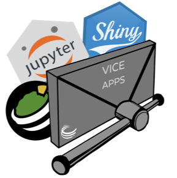
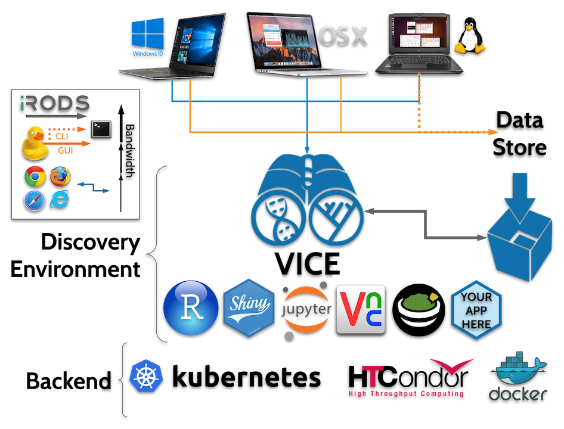

---?image=https://media.giphy.com/media/iFdLJEHEHaSNG/giphy.gif
 LEMON LABS

 May 16, 2019  

 Tyson L. Swetnam 

+++

---?image=http://tile.loc.gov/image-services/iiif/service:gmd:gmd433:g4333:g4333p:la000006/full/pct:25/0/default.jpg
ROADMAP 

+++

 Act I: Hey kid, here's some lidar data  

 Act II: Postdoctoral Blues  

 Act III: Cyberinfrastructure 

 Act IV: ?  

+++

Wildland Firefighter → Forest Ecologist 

---?image=https://wiki.cyverse.org/wiki/download/attachments/18188179/example_fig.png

---?image=https://ebbcff1d-a-32ed3923-s-sites.googlegroups.com/a/email.arizona.edu/tyson-swetnam/home/uofa.png

---

 Challenge: No teachers, access to data, processing, storage 

---

 Solution: Reach out, found peer groups, developed a mentoring network 

 Solution: Time → national data repositories and cloud storage came around, eventually 

 Failure: Self-taught → Time wasted 

---

---

---?image=https://en.wikipedia.org/wiki/Critical_Zone_Observatories#/media/File:Czone_chorover_et_al_catalina_jemez_czo.png

 Challenge: Identifying THE science question(s) to ask 

---

 "Solution" across disciplines: Concentration Discharge relationships → Landscape and Topographic Carbon Balances 

---

 Failure: Adoption by CZO scientists 

---

2014 All Hands Meeting

---?image=https://media.giphy.com/media/9uI9WOCm7WCf4wwhro/giphy.gif

---?image=https://media.giphy.com/media/iOXMcT2qEiIUg/giphy.gif

---

 ...A chance encounter with a guy who liked mangoes. 

---

---?image=https://wol-prod-cdn.literatumonline.com/cms/attachment/e4ecd5f8-d7f6-41a1-9984-c23a09db5b33/ecs21797-fig-0003-m.jpg

---

Challenge: Reviewer #2 says we need to do a comprehensive uncertainty analysis of our forest census

---

Solution: Reproducible notebooks

Analyzed data in CyVerse|XSEDE Jetstream, share work with collaborators at other institutions, work in R notebooks.

---

---?image=https://media.giphy.com/media/1SMYk3HBzaK3e/giphy.gif
@snap[west text-smallcaps text-white]
Aerial lidar
@snapend

@snap[east text-smallcaps text-white]
sUAS SfM
@snapend

+++
---?image=https://media.giphy.com/media/WoD6JZnwap6s8/giphy.gif
 BIG DATA 

---?image=https://emtemp.gcom.cloud/ngw/globalassets/en/research/images/illustrations/researchmethodology-illustration-hype-cycle.jpg

---?image=https://media.giphy.com/media/ZNKTKocoj8e973Wptz/giphy.gif
## sUAS = AWESOME!
+++

+++
# PEAK OF (INFLATED) EXPECTATION

 Ultra High Spatial Resolution  <!-- .element: class="fragment" -->

 Frequent Temporal Return Interval  <!-- .element: class="fragment" -->

 Cheap  <!-- .element: class="fragment" -->

---?image=https://media.giphy.com/media/l0HlDHQEiIdY3kxlm/giphy.gif
## sUAS = PTSD

---?image=assets/imagery/firefly6_crash2.jpg
---?image=assets/imagery/firefly_crash1.jpg

# TROUGH OF DISALLUSIONMENT

 Difficult to build and fly  <!-- .element: class="fragment" -->

 Needs integration across systems (Camera, RTK GNSS, lidar, etc)  <!-- .element: class="fragment" -->

 Big Data → Requires massive computer processing  <!-- .element: class="fragment" -->

+++
## sUAS pilot = new profession

---?image=https://media.giphy.com/media/1SMYk3HBzaK3e/giphy.gif
@snap[west text-smallcaps text-white]
Cyberinfrastructure
@snapend

@snap[east text-smallcaps text-white]
sUAS
@snapend
+++

---?image=https://media.giphy.com/media/uKpWZU3VXLprW/giphy.gif
 MOVING ONTO CYBERINFRASTRUCTURE 

---?image=https://media.giphy.com/media/GkQBupPcf5b1e/giphy.gif
 NOT YOUR LAPTOP OR DESKTOP 

---?image=https://media.giphy.com/media/wUCgLRvDdtWs8/giphy.gif
# Have Workflow, Will Travel

+++
Graphical User Interfaces 
 
- Need more computing power than a laptop 
- Cannot afford to buy a $5,000 workstation 

---?image=assets/imagery/dockerhub_ubuntu_xfce.png
---?image=assets/imagery/metashape.jpg

+++
 Power Users 

- Interest in scaling workflow beyond the laptop / desktop onto HPC and Cloud 
- Need to run 10s to 1,000s of jobs (sUAS flights) across a large geographic area 

---?image=assets/imagery/agisoft_network.png
+++

### The "Bring Your Own Data" Approach

+++

### Important: CyVerse is enabled by People & Research Objectives

### Success depends on users innovating within an ecosystem of interoperability  

+++

 

 NOT!  <!-- .element: class="fragment" -->

+++

### In CyVerse _we work with you_  to identify the tools, workflows, and datasets you need.

   

### Visual Interactive Computing Environment (VICE)

Work with your data interactively in your favorite IDE

+++

---?image=assets/imagery/qgis_vice.jpg

---

## Why are we focused on automating this stuff?

 Good programmers are hard working. <!-- .element: class="fragment" --> 
    
 Great programmers are lazy. <!-- .element: class="fragment" --> 

+++

[Alan Perlis, 1982 Epigrams on Programming](https://web.archive.org/web/19990117034445/http://www-pu.informatik.uni-tuebingen.de/users/klaeren/epigrams.html)

**54. Beware of the Turing Tarpit in which everything is possible but nothing of interest is easy.**

+++

### Building the "best" workflows and pipelines takes time and experience

+++

### Getting stuff done.

 1) Do the things. <!-- .element: class="fragment" -->
 → 2) Do the things right. <!-- .element: class="fragment" -->

 → 3) Do the things well. <!-- .element: class="fragment" -->

---

## Acknowledgments

GIFs by Giphy.com

All digital images shown this presentation are available online and are the property of their creators, their web addresses are visible in the source code of this presentation at: https://github.com/tyson-swetnma/usgs-uav-weibnar/PITCHME.md 

---?image=assets/imagery/endslide.png
