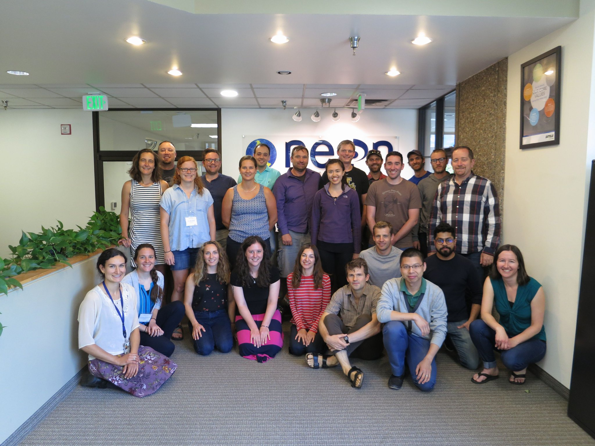

---?image=https://media.giphy.com/media/QtGaQ3b9ByLIY/giphy.gif
 All the Things

 October 1, 2019  

 Tyson L. Swetnam 

+++

---?image=http://tile.loc.gov/image-services/iiif/service:gmd:gmd433:g4333:g4333p:la000006/full/pct:25/0/default.jpg 
ROADMAP

+++
---?image=https://media.giphy.com/media/zOSxTrEnUmHIY/giphy.gif
 Act I: Why am I here?  

+++

### Wildland Firefighter → Forest Ecologist → Data Scientist → Research Professor

---?image=https://wiki.cyverse.org/wiki/download/attachments/18188179/example_fig.png

+++

 Challenges:  

No teachers

access to data limited processing, storage 

+++

 Solution: Reach out, found peer groups, developed a mentoring network 

 Solution: Time  

→ national data repositories and cloud storage, eventually → https://usgs.entwine.io/

 Failure: Self-taught → Time wasted 

+++

### Budget Control Act 2011 → Budget Sequester 2013

+++

 Failure: 
  
Student Temporary Experience Program ≠ Federal Scientist Career

+++

 Act II: Internet of Things & Edge Computing  

+++

---?image=assets/imagery/CEREUS.png

 Challenge: 

Identify THE science question(s) to ask

+++

 "Solution" across disciplines: Concentration Discharge relationships → Landscape and Topographic Carbon Balances 

+++

+++

---?image=https://media.giphy.com/media/WoD6JZnwap6s8/giphy.gif
 BIG DATA 

+++

2014 All Hands Meeting

---?image=https://media.giphy.com/media/9uI9WOCm7WCf4wwhro/giphy.gif

---?image=https://media.giphy.com/media/iOXMcT2qEiIUg/giphy.gif

---

---?image=https://media.giphy.com/media/1SMYk3HBzaK3e/giphy.gif
@snap[west text-smallcaps text-white]
Aerial lidar
@snapend

@snap[east text-smallcaps text-white]
sUAS SfM
@snapend

+++

---?image=https://emtemp.gcom.cloud/ngw/globalassets/en/research/images/illustrations/researchmethodology-illustration-hype-cycle.jpg

---?image=https://media.giphy.com/media/ZNKTKocoj8e973Wptz/giphy.gif
## sUAS = AWESOME!
+++

# PEAK OF (INFLATED) EXPECTATION

 Ultra High Spatial Resolution  <!-- .element: class="fragment" -->

 Frequent Temporal Return Interval  <!-- .element: class="fragment" -->

 Cheap  <!-- .element: class="fragment" -->

---?image=https://media.giphy.com/media/l0HlDHQEiIdY3kxlm/giphy.gif
## sUAS = PTSD

---?image=assets/imagery/firefly6_crash2.jpg

---?image=assets/imagery/firefly_crash1.jpg

---?image=https://media.giphy.com/media/l4HnN3TbBNYZbeEdq/giphy.gif
# TROUGH OF DISALLUSIONMENT

---

# sUAS Bottlenecks

 Difficult to build and fly  <!-- .element: class="fragment" -->

 Needs integration across systems (Camera, RTK GNSS, lidar, etc)  <!-- .element: class="fragment" -->

 Big Data → Requires massive computer processing  <!-- .element: class="fragment" -->

---?image=assets/imagery/meta.jpg
---?image=assets/imagery/agisoft_network.png
+++

 Act III: Cyberinfrastructure 

---?image=https://media.giphy.com/media/1SMYk3HBzaK3e/giphy.gif
@snap[west text-smallcaps text-white]
Cyberinfrastructure
@snapend

@snap[east text-smallcaps text-white]
sUAS
@snapend
+++

---?image=https://wol-prod-cdn.literatumonline.com/cms/attachment/e4ecd5f8-d7f6-41a1-9984-c23a09db5b33/ecs21797-fig-0003-m.jpg

---?image=https://media.giphy.com/media/uKpWZU3VXLprW/giphy.gif
 Getting through Peer Review 

+++
 Challenge: 

Reviewer #2 → comprehensive uncertainty analyses required

+++

 Solution: Reproducible notebooks 

Analyze data in CyVerse|XSEDE Jetstream, share work with collaborators at other institutions, work in R notebooks.

---?image=https://media.giphy.com/media/GkQBupPcf5b1e/giphy.gif
 NOT YOUR LAPTOP OR DESKTOP 

+++
 Challenge: No one in my old community knows what I do 

---?image=https://media.giphy.com/media/wUCgLRvDdtWs8/giphy.gif
# Have Workflow, Will Travel

+++

 

+++
 Challenges 

- Drive adoption of CyVerse by NEON community 
- Do all the things 

+++

Solution: Demonstrate CyVerse abilities to them

https://github.com/cyverse-gis/NEON-Shiny-Browser

+++

 Acknowledging Failures: 

**Do not attempt to teach cloud, containers, & computational notebooks in one afternoon**

Battelle-NEON self pwn January 2019 ends foundational collaboration with leadership.

+++

[Alan Perlis, 1982 Epigrams on Programming](https://web.archive.org/web/19990117034445/http://www-pu.informatik.uni-tuebingen.de/users/klaeren/epigrams.html)

**54. Beware of the Turing Tarpit in which everything is possible but nothing of interest is easy.**

+++

### Building the "best" workflows and pipelines takes time and experience

+++

### Get stuff done.

 1) Do the thing. <!-- .element: class="fragment" -->

 → 2) Do the thing right. <!-- .element: class="fragment" -->

 → 3) Do the thing well. <!-- .element: class="fragment" -->
  
---

## Acknowledgments

GIFs by Giphy.com

All digital images shown this presentation are available online and are the property of their creators, their web addresses are visible in the source code of this presentation at: https://github.com/tyson-swetnam/agic-presentation

---?image=assets/imagery/endslide.png
