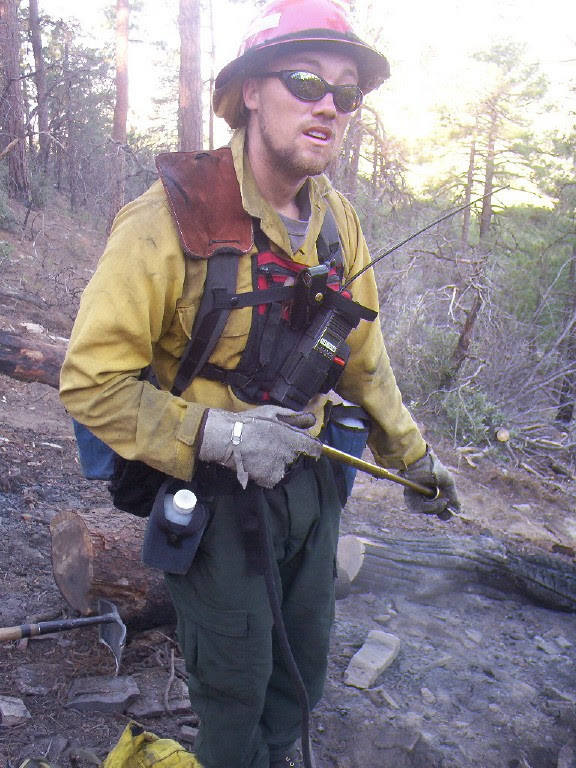
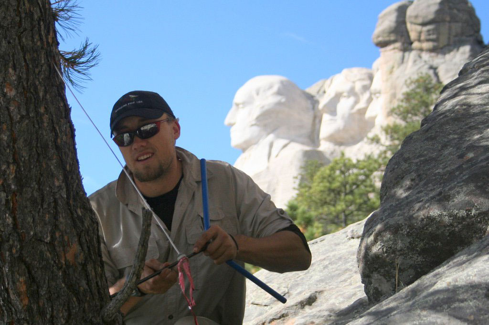
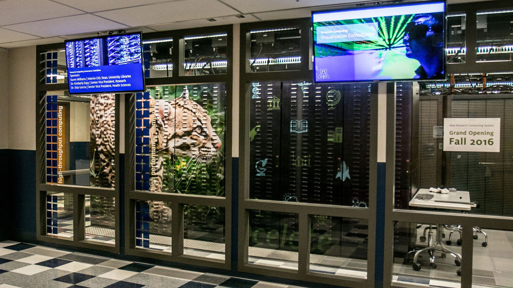

 All the Things

 

 October 1, 2019  

 Tyson L. Swetnam 

---?image=https://media.giphy.com/media/zOSxTrEnUmHIY/giphy.gif
 Act I: Why am I here?  

+++

#### Wildland Firefighter → Forest Ecology PhD

+++

 Circa 2008 AD 

 PhD project: estimate landscape scale forest C  <!-- .element: class="fragment" -->

 → Hey here's some lidar data, good luck!  <!-- .element: class="fragment" --> 

 <!-- .element: class="fragment" -->

+++ 

 2008 Challenges  

 → Limited access to data sets  <!-- .element: class="fragment" -->

 → Limited software to work with the data  <!-- .element: class="fragment" --> 

 → Limited processing and storage options  <!-- .element: class="fragment" --> 

+++

 Circa 2019 AD 

 

 → Know how to code  <!-- .element: class="fragment" -->

 → Comfortable working with big data  <!-- .element: class="fragment" -->

 → Endless data streams from 3DEP, NEON, GEE, NASA EOS, Planet, sUAS  <!-- .element: class="fragment" -->

 → Nearly limitless processing with cloud and HPC  <!-- .element: class="fragment" -->

+++
 New Challenges  

 

 → Only a few people can work with these  <!-- .element: class="fragment" -->

 → No one person can do all these things  <!-- .element: class="fragment" -->

 → Technology continues to advance at exponential rate  <!-- .element: class="fragment" -->

 <!-- .element: class="fragment" -->

+++

 <!-- .element: class="fragment" -->
    
+++

---?image=https://media.giphy.com/media/5hCKTPam0ZRo4/giphy.gif
 Act II: Big Data, Cyberinfrastructure, Internet of Things, Edge Computing  

+++

 Things you need to know about 

 Cyberinfrastructure  <!-- .element: class="fragment" -->

 Data Management Systems (DMS)  <!-- .element: class="fragment" -->

 Workflow Management Systems (WMS)  <!-- .element: class="fragment" -->

 FAIR Data Principles  <!-- .element: class="fragment" -->

 Internet of Things (IoT)  <!-- .element: class="fragment" -->

 Edge Computing  <!-- .element: class="fragment" -->

---?image=https://emtemp.gcom.cloud/ngw/globalassets/en/research/images/illustrations/researchmethodology-illustration-hype-cycle.jpg

---?image=https://media.giphy.com/media/WoD6JZnwap6s8/giphy.gif
 Cyberinfrastructure 

+++

 Working with big data 

 GB  <!-- .element: class="fragment" -->  → TB  <!-- .element: class="fragment" -->  → PB  <!-- .element: class="fragment" -->  → EB  <!-- .element: class="fragment" -->

+++

 NOT YOUR LAPTOP OR DESKTOP 

 Work remotely  <!-- .element: class="fragment" -->

 Data Management Systems  <!-- .element: class="fragment" -->

 Workflow Management Systems  <!-- .element: class="fragment" -->

+++

 Data Management Systems 

CyberGIS - Google Earth Engine

THREDDS, FTP, 

Cloud Object Storage - S3, GCP

+++

  Workflow Management Systems 

+++

*different OS + third party software + updates/upgrades + redeployment* → 
 _Dependency Hell_  
 
 <!-- .element: class="fragment" -->  <!-- .element: class="fragment" -->

  Source: XKCD.com, E. Dolstra 2006 https://nixos.org/~eelco/pubs/phd-thesis.pdf  
 
+++ 

## Solution: Containerize software, run it anywhere. 

   

+++

## Why Containerize?

- Dependencies turn into wicked problems <!-- .element: class="fragment" -->
- Compiling software is sloooowww <!-- .element: class="fragment" -->
- Reproducibility is hard across platforms <!-- .element: class="fragment" -->
- Portability <!-- .element: class="fragment" --> **& _Scalability_** <!-- .element: class="fragment" -->

 

+++

##### PRIVATE CLOUD SERVICES

+++

[Alan Perlis, 1982 Epigrams on Programming](https://web.archive.org/web/19990117034445/http://www-pu.informatik.uni-tuebingen.de/users/klaeren/epigrams.html)

**54. Beware of the Turing Tarpit in which everything is possible but nothing of interest is easy.**

+++

### Building the "best" workflows and pipelines takes time and experience

+++

## The FAIR data principles

 Findable  <!-- .element: class="fragment" -->
 Accessible  <!-- .element: class="fragment" -->
 Interoperable  <!-- .element: class="fragment" -->
 Reusable  <!-- .element: class="fragment" -->

+++

---?image=http://mattturck.com/wp-content/uploads/2019/07/2019_Matt_Turck_Big_Data_Landscape_Final_Fullsize.png

---?image=assets/imagery/FOSS.png

---?image=https://media.giphy.com/media/iOXMcT2qEiIUg/giphy.gif

+++

## IoT

---?image=assets/imagery/cereus.png

+++

---?image=https://media.giphy.com/media/ncsEqTn98T1GHVq62k/giphy.gif
 Act III: Earth Observation Systems 

---?image=assets/imagery/hdr_low.png

---?image=https://media.giphy.com/media/ZNKTKocoj8e973Wptz/giphy.gif
## sUAS are AWESOME!
+++

### PEAK OF (INFLATED) EXPECTATION

 Ultra High Spatial Resolution  <!-- .element: class="fragment" -->

 Frequent Temporal Return Interval  <!-- .element: class="fragment" -->

 Cheap  <!-- .element: class="fragment" -->

---?image=https://media.giphy.com/media/l0HlDHQEiIdY3kxlm/giphy.gif

## sUAS can cause PTSD

---?image=assets/imagery/firefly6_crash2.jpg

---?image=assets/imagery/firefly_crash1.jpg

---?image=https://media.giphy.com/media/l4HnN3TbBNYZbeEdq/giphy.gif

## THE TROUGH OF DISALLUSIONMENT

---

##### WHICH SfM sUAS SOFTWARE??

+++

+++

## sUAS Bottlenecks

 Difficult to build and fly  <!-- .element: class="fragment" -->

 Needs integration across systems (Camera, RTK GNSS, lidar, etc)  <!-- .element: class="fragment" -->

 Big Data → Requires massive computer processing  <!-- .element: class="fragment" -->

---?image=assets/imagery/meta.jpg
---?image=assets/imagery/agisoft_network.png

---?image=https://media.giphy.com/media/1SMYk3HBzaK3e/giphy.gif
@snap[west text-smallcaps text-white]
CubeSats
@snapend

@snap[east text-smallcaps text-white]
sUAS
@snapend

+++

## GEE

+++

## CubeSats

+++

 Act IV: Publishing your work 

---?image=https://media.giphy.com/media/uKpWZU3VXLprW/giphy.gif
 Getting through Peer Review 

---?image=https://wol-prod-cdn.literatumonline.com/cms/attachment/e4ecd5f8-d7f6-41a1-9984-c23a09db5b33/ecs21797-fig-0003-m.jpg
## Landscape scale C balances

+++
 Challenge 

 Reviewer #2 → "a comprehensive uncertainty analyses is required for publication in this journal"   <!-- .element: class="fragment" -->  <!-- .element: class="fragment" -->

+++

 Solution  

 → Code on GitHub  <!-- .element: class="fragment" -->

 → Container on DockerHub  <!-- .element: class="fragment" -->

 → Reproducible notebooks in R  <!-- .element: class="fragment" -->

 → Analyze data in CyVerse cyberinfrastructure  <!-- .element: class="fragment" -->  <!-- .element: class="fragment" -->

+++

### Get stuff done.

 1) Do the thing. <!-- .element: class="fragment" -->

 2) Do the thing right. <!-- .element: class="fragment" -->

 3) Do the thing well. <!-- .element: class="fragment" -->
  
+++

### Gain Data Science Skills

https://carpentries.org

+++

### [The Learning Center](http://learning.cyverse.org/en/latest/) 

 

http://learning.cyverse.org/en/latest/

+++

Foundational Open Science Skills (FOSS) Feb 17–21 2020

CyVerse Container Camp, March 10-13 2020

https://www.cyverse.org

Location: University of Arizona, Tucson AZ

---

## Acknowledgments

GIFs by Giphy.com

All digital images shown this presentation are available online and are the property of their creators, their web addresses are visible in the source code of this presentation at: https://github.com/tyson-swetnam/agic-presentation

---?image=assets/imagery/endslide.png
